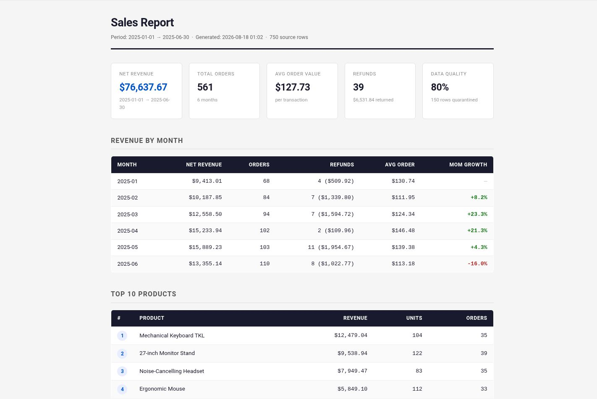

# Sales Report Automator

[](https://github.com/Mohaned-Fozy-Ai/sales-report-automator/actions/workflows/tests.yml)  

> Turn a messy exported orders CSV into a clean, professional monthly business report — automatically.

**Stack:** Python 3.9+ · Standard library only (csv, decimal, statistics, dataclasses, argparse, logging) · Zero pip installs required

*Verified on Python 3.9.25 (see `RUN_OUTPUT.txt`).*

---

## The Problem

Every month, a store owner exports their raw orders from Shopify or WooCommerce — a spreadsheet full of inconsistent column names, missing prices, duplicate rows, and dates in four different formats. They spend 2–3 hours manually cleaning it, writing formulas, and building a summary to share with their accountant or business partner. If they rush, they miss refunded orders or count a future-dated entry as real revenue. The work is tedious, error-prone, and happens again next month.

## The Solution

This tool reads one or many CSV files from any e-commerce platform, automatically maps whichever column names they use, quarantines every bad row with a plain-English reason, and generates three ready-to-share outputs: a machine-readable CSV, a Markdown report, and a professionally designed HTML report. The store owner drops their export file into a folder and runs one command. The tool handles the rest.

## Business Value

| Before (manual) | After (automated) |
|---|---|
| 2–3 hours of spreadsheet work each month | One command, ~0.04 seconds |
| Revenue miscounted if refunds missed | Refund/return rows detected and handled correctly |
| Rows silently dropped when data is dirty | Every bad row quarantined with a reason in `quarantine.csv` |
| Copy-pasted formulas break when columns change | Tolerant column mapper handles 30+ header spelling variants |
| Charts and formatting rebuilt from scratch | HTML report auto-generated with finance-grade design |

- **Time saved:** Assumption — a store owner spends ~2.5 hours per monthly reconciliation. This tool reduces that to under 5 minutes of review (running the command + reviewing quarantine.csv). That is ~2 hours 25 minutes saved per run, or ~29 hours per year.
- **Errors eliminated:** Silent revenue miscounts from missing prices, duplicate order IDs counted twice, and refunds not deducted.
- **Who this is for:** A store owner or operations manager who reconciles orders by hand every month before sending numbers to their accountant.

## Demo

```
python -m reporter --demo
```



*Screenshot: the HTML report generated by `python -m reporter --demo` against the 750-row sample dataset. This is real output from the shipped demo, captured on Python 3.9.25.*

```
============================================================
  REPORT COMPLETE
============================================================
  Source rows   : 750
  Valid         : 600
  Quarantined   : 150
  Net Revenue   : $76,637.67
  Total Orders  : 561
  Avg Order     : $127.73
  Anomalies     : 39
  Runtime       : 0.04s  (20,958 rows/s)

  Output files:
    output/summary.csv
    output/report.md
    output/report.html
    output/quarantine.csv
============================================================
```

The HTML report (`output/report.html`) is a single self-contained file you can open in any browser or email directly. See `docs/` for a screenshot.

## How It Works

1. **Load** — reads one or many CSVs via glob pattern; maps whichever column names the platform uses to canonical field names
2. **Validate** — checks every row against 6 quality rules; quarantines bad rows to `output/quarantine.csv` with a human-readable `reason` column
3. **Analyse** — computes monthly revenue, product rankings, average order value, month-over-month growth %, and refund totals using `Decimal` arithmetic
4. **Detect anomalies** — flags products with >40% revenue drop and individual orders more than 3 standard deviations above average
5. **Render** — writes three output files: `summary.csv` (machine-readable), `report.md` (human-readable), `report.html` (shareable, no external dependencies)

```
CSV files → loader.py → validate.py → analyze.py → render_md.py  → report.md
                                                  ↘ render_html.py → report.html
                                                  ↘ render_csv.py  → summary.csv
                         quarantine.csv ←──────────┘
```

## Setup

```bash
git clone https://github.com/mohaned-fozy/sales-report-automator
cd sales-report-automator
python -m venv .venv && source .venv/bin/activate
pip install -r requirements.txt          # nothing to install — stdlib only
python -m reporter --demo
```

To process your own data:

```bash
python -m reporter "exports/*.csv" --output-dir my_output/
```

## Configuration

No environment variables required. All behaviour is controlled by command-line arguments.

| Flag | Required? | Default | Purpose |
|------|-----------|---------|---------|
| `pattern` | Yes (or `--demo`) | — | Glob pattern for input CSV files, e.g. `"exports/*.csv"` |
| `--output-dir` / `-o` | No | `output/` | Directory where the three output files are written |
| `--demo` | No | off | Runs the full pipeline against `sample_data/` with no other arguments |
| `--verbose` / `-v` | No | off | Enables DEBUG-level logging (shows per-file row counts, etc.) |

**Column mapping** is controlled by `COLUMN_ALIASES` in `reporter/loader.py`. Add rows there to support additional header spellings without touching the rest of the code.

## Tests

```bash
python -m unittest discover -v
```

Measured: **59 tests passing** (Python 3.9.25 — unit tests for loader, validator, analyser, and full integration pipeline).

## Limitations (honest)

- **Single-currency only.** All `unit_price` values are treated as the same currency. Multi-currency exports need pre-processing.
- **No chart generation.** The HTML report contains tables and a KPI strip, not charts or graphs. Adding charting would require a third-party library or significant JavaScript.
- **Memory-bound for very large files.** All records are loaded into memory at once. Files over ~500k rows on a low-memory machine may be slow.
- **Column mapping is static.** Adding a new header alias requires editing `loader.py`. A future version could accept a `--column-map` config file.
- **Date ambiguity.** `01/02/2025` is parsed as DD/MM (UK) before MM/DD (US). If your data is US-formatted and the day is ≤ 12, results may be incorrect — set up a dedicated date format alias in `loader.py`.
- **No scheduling built in.** The tool runs on demand. Wrapping it in a cron job or scheduled task is the user's responsibility.

## Author

Mohaned Mohamed Fozy — Python automation & AI integration. Cairo, Egypt.

GitHub: https://github.com/Mohaned-Fozy-Ai
<!-- FILL: LinkedIn URL -->

## License

MIT
